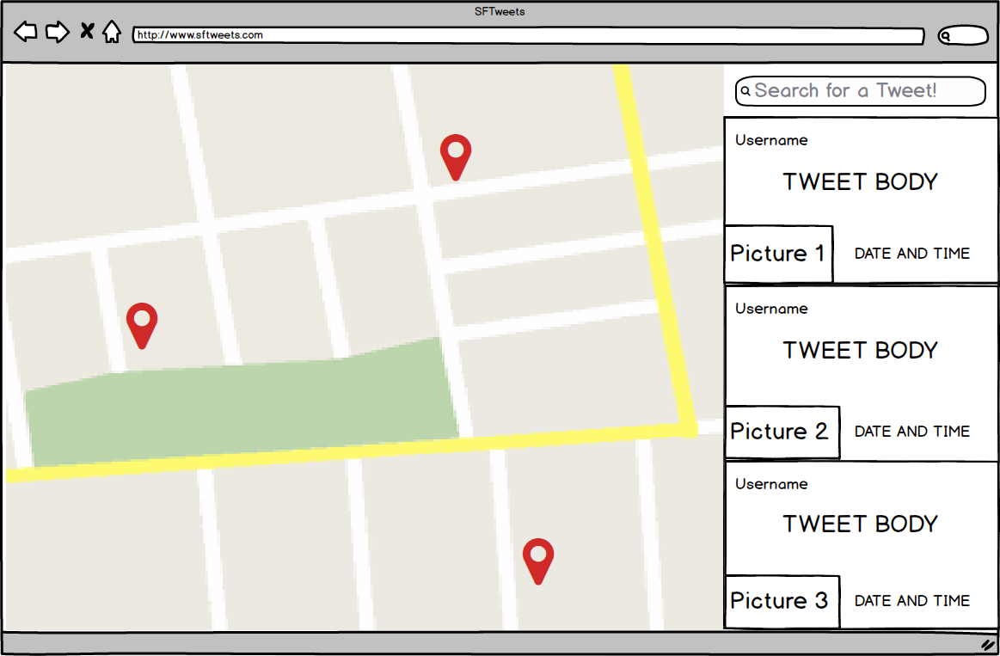

## SFTweets

### Background

Wouldn’t you like to know where people are tweeting about tacos?

Twitter has some search features, but not a great way to geolocate them. SFTweets will take any search query and place tweets matching that query on a map. This adds a visual component and a geographical complement to geolocated tweets.

### Functionality & MVP

Users will be able to:

- [ ] Use search to interact with the twitter API
- [ ] See search results mapped out by coordinates within a given radius
- [ ] See search results displayed in a dynamic, interactive side column
- [ ] Click on any tweet on the map and bring up a modal with tweet details

### Wireframes

### Technologies & Technical Challenges

This app will utilize React.js, Redux, Twitter API, , Google Maps API, Rails 5, HTML, CSS.

React will store the current state of the tweets we are placing using the search request. The whole front-end will be built using a Redux architecture. A search query will run through a Rails RESTful API in order to render results, and all the results will be displayed using JS, HTML, and CSS.

The primary challenges will be:

- [ ] Interacting with the Twitter API. The documentation is just okay and there will be a lot of learning to do
- [ ] Plotting tweets on Google Maps. Not every tweet has an exact geographic location (some users restrict access).
- [ ] Managing the Twitter API Rate Limits. Twitter will blacklist dev accounts with too many REST requests, so we must ensure that we never exceed those limits.

### Group Members & Work Breakdown

Our group has 4 members: Elif Sezgin, Nico Giraldo, Michael Altamirano, and Adrian Lobdill.

Elif’s primary responsibilities will be:

- Building a display modal for individual tweets
-  Assist Nico with any Google Maps challenges

Nico’s primary responsibilities will be:

- Building out Redux cycle for parsing search results
- Mapping tweets using the Google Maps API

Michael's primary responsibilities will be:

- Processing Twitter API results
- Git captain. He will help manage merge conflicts and oversee app architecture

Adrian's primary responsibilities will be:

- Building out sidebar column component for displaying tweets
- Assist Mike with any Twitter API challenges

### Implementation Timeline

**Day 1**: A basic Redux structure built and the ability to make Twitter requests using Ruby/Rails:

- Twitter requests should be returning good data
- Maps should be able to render and markers can be rendered on the map
- All team members are on board with workflow and have working copies of the repo

**Day 2**: App should have some basic visual functionality, but components do not necessarily work together

- Twitter requests should return good data in Views via JBuilder
- Map and sidebar should be able to read data from Twitter requests
- A bug list will be hosted on Trello

**Day 3**: Maps and sidebar will be able to work together concurrently, as well as basic modal functionality

- Clicking on a sidebar result will focus the map on that tweet
- Search component will be started on, and returns some amount of information based on search query

**Day 4**: Search will be refined and should populate the map and column with search results

- The project should be hosted on Heroku and a team member will be dedicated as the live build master
- Everything on the project should work together tightly and our Git workflow should be in place.

**Day 5**: This day will be dedicated to error handling, nailing down any remaining bugs, and finalizing site design.

- We will have a meeting about where any errors should be handled and ensure that they are being thrown properly
- In the same meeting we will discuss any remaining bugs and which of them need to be fixed before release

### Bonus Features

- Search by user. Clicking on a button will cause the search to only search for users rather than keyword in tweets.
- Expand map. Should be able to scroll around the map anywhere in the world and search for keywords.
- Tweets by neighborhood. A checkbox list will allow users to only see tweets within a certain neighborhood in San Francisco.
